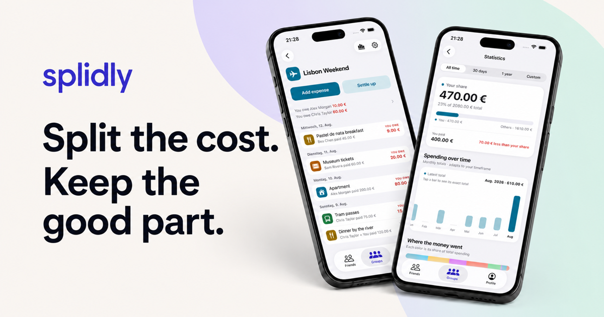

# Splidly

<p align="center">
  
</p>

<p align="center"><strong>Split the cost. Keep the good part.</strong></p>

Splidly is a free, open-source app for tracking shared expenses with friends,
households, and travel groups. Add what everyone paid, see clear balances, and
settle up without turning the plan into a spreadsheet.

<p align="center"><a href="https://splidly.site"><strong>Visit splidly.site →</strong></a></p>

## Why Splidly?

- Flexible expense splitting
- Multiple currencies with frozen conversion rates
- Clear balances, statistics, and settlements
- No ads — fully open source

## Built in the open

Splidly is developed by
[Florian2807](https://github.com/Florian2807) and
[LosFarmosCTL](https://github.com/LosFarmosCTL).

[Explore the source](https://github.com/Splidly/splidly) ·
[Report an issue](https://github.com/Splidly/splidly/issues)

---

## For developers

Splidly is an Expo and Hono monorepo backed by PostgreSQL, Drizzle, tRPC, and
Better Auth.

- `apps/mobile` — iOS and Android app
- `apps/server` — API and public website
- `packages/db` — database schema and migrations
- `packages/shared` — shared contracts and money utilities

See **[Development and deployment setup](docs/SETUP.md)** to run Splidly,
configure identity providers and notifications, or deploy your own instance.
For vulnerability reporting and production controls, see the
**[security policy](SECURITY.md)** and
**[security operations runbook](docs/SECURITY_OPERATIONS.md)**.
Production server and store configuration is covered in the
**[deployment section](docs/SETUP.md#production)**.

```sh
pnpm typecheck
pnpm test
pnpm build
```

## License

Splidly is available under the [MIT License](LICENSE).
